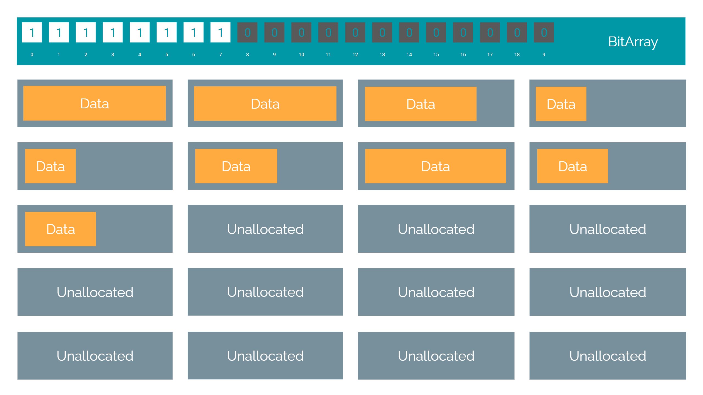
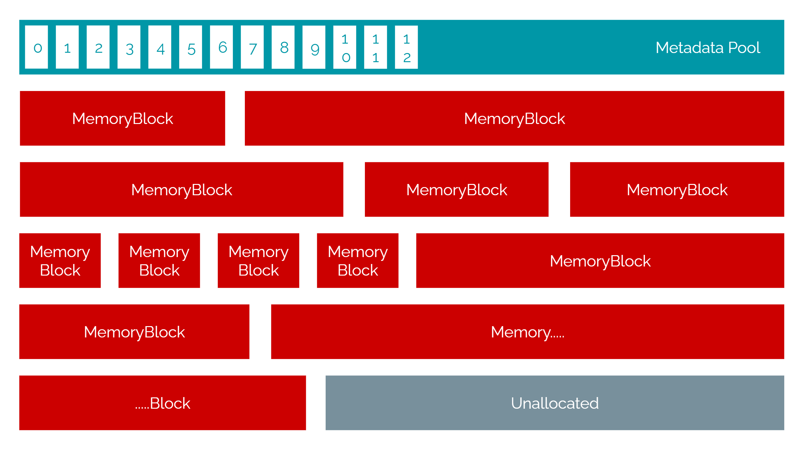

# Custom Game Engine
This is a game engine I built from scratch on C++  
It includes the following systems: 
  1. A <b>Linear Memory-Pool</b> Allocator
  2. A <b>Fixed Size</b> Allocator
  3. A <b>Custom Smart-Pointer</b> System
  4. A <b>2D-Physics</b> Engine
  5. A <b>Box-2D Collision</b> Engine
  6. Unreal's <b>Actor Hierarchy</b> System (To build Player & NPC actors from)
  7. Dynamic <b>Component Attachment</b> System (E.g. Keyboard Inputs, Box Collider, Circle Collider)

 

<b>NOTE:</b> Git doesn't recognize changes to the solution's Default Project. So you'd have to select Pong as the Default Startup Project under the Solution's Properties in Visual Studio

 

##  Memory Allocation System
Here's a list of all the unique features the MemoryManager has:

1. Primary Allocator Unit => Created a <b>Fixed Size Allocator (FSA)</b> & included 3 instances of it to handle allocations of different sizes (100 - <b>16 byte blocks</b> | 200 - <b>32 byte blocks</b> | 400 - <b>96 byte blocks</b>)
	- <a href="https://github.com/Vieper1/MemoryManager/blob/part2/Engine/Memory/FixedSizeAllocator.h">Header</a> | <a href="https://github.com/Vieper1/MemoryManager/blob/part2/Engine/Memory/FixedSizeAllocator.cpp">C++</a>
	- The FSA is able to store anything <b>less than its BLOCK SIZE</b> to be stored in the <b>first free block</b>
	- This one's <b>highly efficient</b> because of the <a href="https://github.com/Vieper1/MemoryManager/blob/part2/Engine/Memory/BitArray.cpp">BIT-ARRAY State-Keeper</a>

 

2. Backup Allocator => <b>Pool Allocator</b>
	- <a href="https://github.com/Vieper1/MemoryManager/blob/part2/Engine/Memory/PoolAllocator.h">Header</a> | <a href="https://github.com/Vieper1/MemoryManager/blob/part2/Engine/Memory/PoolAllocator.cpp">C++</a>
	- The <b>Memory-Pool</b> style allocator allocates blocks <b>linearly</b> regardless of their size
	- There's a <b>ratio of the TOTAL POOL SIZE</b> that stores <b>metadata</b> for each of the allocated blocks

 

3. The MemorySystem regulates the calls to the 3 FSAs or the Pool Allocator
based on the size of the request
	- <a href="https://github.com/Vieper1/MemoryManager/blob/part2/Engine/Memory/MemorySystem.h">Header</a> | <a href="https://github.com/Vieper1/MemoryManager/blob/part2/Engine/Memory/MemorySystem.cpp">C++</a>
	- This system <b>receives the allocation calls</b> and invokes the <b>respective allocator</b>

  

##  Custom Smart-Pointer System
Features:
  1. <b>Smart Pointer</b> (reference) running a <b>Reference Count book-keeping</b> method to decide <b>underlying pointer lifetime</b>
  2. <b>Weak Pointer</b> running the same book-keeping method, for systems that just want to watch the underlying pointer, or <b>get a Ref</b> to the SmartPtr

  

##  2D Physics Engine
Features:
  1. Config: [Mass], [Linear Damping], [Gravity], [Net Force]
  2. Every object has <b>Velocity</b>
  3. Acceleration is imparted based on the <b>Mass</b>, which in turn controls how fast the Velocity changes per frame
  4. Linear Damping controls the acceleration resisting force
  5. If you use the <b>APPLY_FORCE(...)</b> function, you'd change the <b>NetForce</b> value, which is applied each frame and cleared

  

##  Box-2D Collision Engine
Features:
  1. <b>Swept-Axis Collision Check</b> formula to deflect off 2-objects with an <b>Impending Collision</b> that's <b>Less Than 1-frame-time</b>
  2. <b>Inter-Frame-Time-Forwarding</b> to resolve more than 2 objects in collison sequentially
  3. <b>Object can register a callback</b> to get notified when it's colliding with anything

  

## Unreal's Actor Hierarchy System
Implemented a World class which handles
  1. Actor Spawning (With and without JSON for prefab)
  2. BeginPlay()
  3. EventTick()
  4. Pause
  5. Quit
  6. Cleanup

      

#  GAME FEATURES

How to play the game:
1. Move the LEFT paddle up/down using W/S
2. Move the RIGHT paddle up/down using I/K
3. If the Ball moves past the left paddle, the right player's score increases by 1 (And vice versa)
4. The first player to reach a score of 3 wins the game
5. The windows shuts itself down to close the game, printing the win-state in the output log

NOTE:	The walls comprise of white square bricks placed close to each other. Each reflect the ball in a random direction to give a sense of randomness to the game
	(Not really an interesting feature, but I just had in there since it makes it fun)
